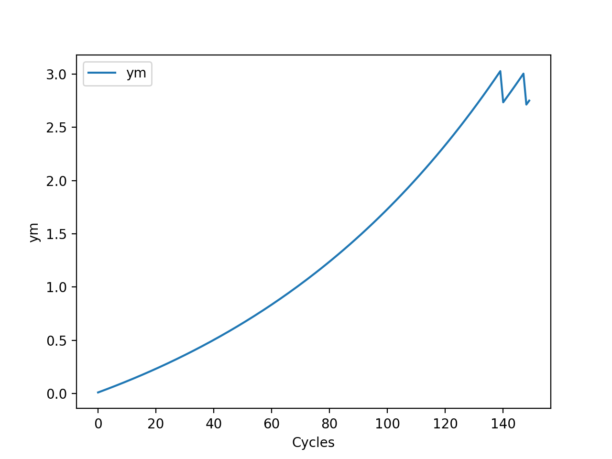

# _concore_
CONTROL-CORE is a framework for closed-loop peripheral neuromodulation control systems. The CONTROL-CORE protocol, known as _concore_, allows modular simulation of controller and PM nodes to run on different operating systems, computing platforms, and programming languages. 

# The concore-lite simple example to test _concore_

## Make Study
```
$ ./makestudy example/sampleplot.graphml
python3 mkconcore.py example/sampleplot.graphml example sampleplot macos
mkconcore 21-12-06
concore path:      .
graphml input:     example/sampleplot.graphml
source directory:  example
output directory:  sampleplot
control core type: posix
treat .m as octave:False
MCR path:          /opt/matlab/MATLAB_Runtime_R2021a_Update_5/v910
Docker repository: markgarnold
```

## Build and run study
```
$ cd sampleplot/
$ ./build
$ ./debug
```

Three new terminals will pop up.


XZ
```
$ cd /concore-lite/sampleplot/XZ;python3 plotym.py
plotym
ym=[0.01]
ym=[0.0201]
ym=[0.030301]
ym=[0.04060401]
ym=[0.0510100501]
ym=[0.061520150601]
ym=[0.07213535210701]
ym=[0.08285670562808009]
ym=[0.09368527268436089]
ym=[0.1046221254112045]
```

PZ
```
$ cd /concore-lite/sampleplot/PZ;python3 pm.py
0.0. u=[[0.]]ym=[[0.01]]
1.0. u=[[0.0101]]ym=[[0.0201]]
2.0. u=[[0.020301]]ym=[[0.030301]]
3.0. u=[[0.03060401]]ym=[[0.04060401]]
4.0. u=[[0.04101005]]ym=[[0.05101005]]
5.0. u=[[0.05152015]]ym=[[0.06152015]]
6.0. u=[[0.06213535]]ym=[[0.07213535]]
7.0. u=[[0.07285671]]ym=[[0.08285671]]
8.0. u=[[0.08368527]]ym=[[0.09368527]]
9.0. u=[[0.09462213]]ym=[[0.10462213]]
10.0. u=[[0.10566835]]ym=[[0.11566835]]
```

CZ
```
$ cd /concore-lite/sampleplot/CZ;python3 controller.py
0.0. u=[[0.]]ym=[[0.]]
1.0. u=[[0.0101]]ym=[[0.01]]
2.0. u=[[0.020301]]ym=[[0.0201]]
3.0. u=[[0.03060401]]ym=[[0.030301]]
4.0. u=[[0.04101005]]ym=[[0.04060401]]
5.0. u=[[0.05152015]]ym=[[0.05101005]]
6.0. u=[[0.06213535]]ym=[[0.06152015]]
7.0. u=[[0.07285671]]ym=[[0.07213535]]
8.0. u=[[0.08368527]]ym=[[0.08285671]]
9.0. u=[[0.09462213]]ym=[[0.09368527]]
10.0. u=[[0.10566835]]ym=[[0.10462213]]
```

## View the output
The below plot will pop up, showing the output from this example.




# Destroy the study.
Finally, you can destroy the study, after closing those terminals and windows.
```
$ cd ..
$ ./destroy sampleplot/
cat: CZ/concorepid: No such file or directory
kill: usage: kill [-s sigspec | -n signum | -sigspec] pid | jobspec ... or kill -l [sigspec]
rm: CZ/concorepid: No such file or directory
cat: PZ/concorepid: No such file or directory
kill: usage: kill [-s sigspec | -n signum | -sigspec] pid | jobspec ... or kill -l [sigspec]
rm: PZ/concorepid: No such file or directory
cat: XZ/concorepid: No such file or directory
kill: usage: kill [-s sigspec | -n signum | -sigspec] pid | jobspec ... or kill -l [sigspec]
rm: XZ/concorepid: No such file or directory
rm: CU/*: No such file or directory
rm: PYM/*: No such file or directory
rm: XYM/*: No such file or directory
```
## To Run On Windows

Replace './COMMAND' by 'COMMAND'.
Example :
Instead of calling 
```
$ ./makestudy example/sampleplot.graphml
```
call
```
> makestudy example/sampleplot.graphml
```


# Read More...

## Configuring _concore_

concore is a lightweight Python-based protocol to simulate neuromodulation control systems. Installation instructions for concore can be found [here](https://control-core.readthedocs.io/en/latest/installation.html).


## Using _concore_

Usage instructions can be found [here](https://control-core.readthedocs.io/en/latest/usage.html).


# Citing _concore_

If you use _concore_ in your research, please cite the below paper:

* Kathiravelu, P., Arnold, M., Fleischer, J., Yao, Y., Awasthi, S., Goel, A. K., Branen, A., Sarikhani, P., Kumar, G., Kothare, M. V., and Mahmoudi, B. **CONTROL-CORE: A Framework for Simulation and Design of Closed-Loop Peripheral Neuromodulation Control Systems**. In IEEE Access. March 2022. https://doi.org/10.1109/ACCESS.2022.3161471 
